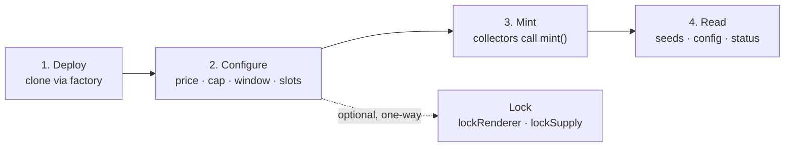
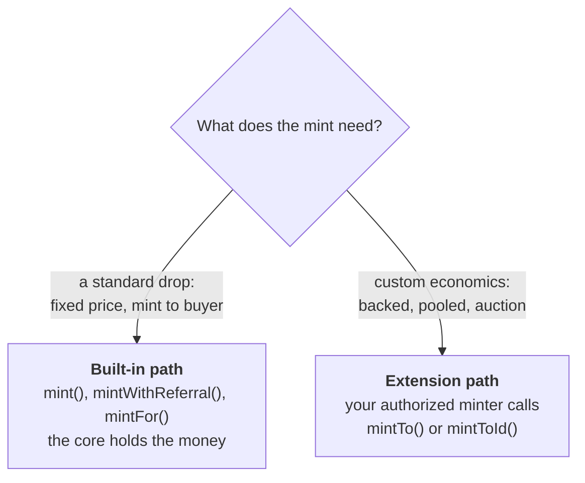

# Collection System: getting started

A practical walkthrough: deploy a collection, configure it, let people mint, and
read what comes out. Plain terms throughout. Every bolded concept is defined in
the [glossary](collection-glossary.md); the deeper rationale is in
[pnd-collection-system.md](pnd-collection-system.md).

## The one-sentence model

One **Collection** is one artist's NFT contract. You deploy it, set a few things
(price, supply, who can mint), and from then on it runs exactly as deployed,
forever.

## The lifecycle

## 1. Deploy

You do not write a contract. The **CollectionFactory** stamps out a new
collection as a cheap clone and calls `initialize` on it once. There are two
doors, one per **id mode**: `createCollection` for the sequential form (the
contract counts ids) and `createPooledCollection` for the pooled form (your
authorized minter chooses ids).

You hand the factory:

- **name, symbol, owner** for the ERC-721.
- **config**: price, supply cap, mint window, royalty, payout address, the
  slot addresses (renderer, price strategy, mint hook), and the two one-way
  locks — pass a lock `true` and the collection is born locked, no second
  transaction to remember. Leave the renderer empty to get the default.
- **initialMinters**: extension minters authorized from the first block, so a
  backed or pooled work deploys fully wired in one transaction.
- **creators**: your side of the attribution handshake, for co-created works
  (each listed creator confirms by claiming the collection in their own
  Catalog).

## 2. Configure

Almost everything stays adjustable — the artist keeps the levers — until you
choose to make a promise permanent. Two locks exist, both one-way:

| Setting | Can change later? |
| --- | --- |
| price, mint window, royalty, payout address | yes, anytime |
| supply cap | yes, until you `lockSupply` |
| renderer | yes, until you `lockRenderer` |
| price strategy, mint hook | yes, anytime |
| extension minters | yes, grant or revoke anytime (`setMinter`) |
| admins | yes, owner grants and revokes anytime |
| id mode (sequential / pooled) | no — it is which contract you deployed |
| cover image, per-token captures | yes, forever (they live in RenderAssets and mirror the art; they are not the art) |

- **`lockSupply`** makes the cap the scarcity promise: an edition of 100 is
  100, and no later minter grant can climb over it.
- **`lockRenderer`** pins the renderer pointer forever. Point it at an
  immutable renderer (a `ScriptyRenderer`, a Solidity SVG work) first and the
  presentation is provably permanent end to end.

## 3. Mint

There are two mint paths. Pick by what your drop needs.

### Built-in path (most drops, sequential form only)

- **`mint(quantity)`**: mints to the caller at the fixed price. The whole price
  goes to the artist. This is the honest default.
- **`mintWithReferral(quantity, referrer, data)`**: the same, but 10% (the
  **referral share**) goes to whoever hosted the mint. Pass the zero address and
  it folds back to the artist. `data` is passed through to the mint hook, if any.
- **`mintFor(to, quantity, referrer, data)`**: the paid gift-mint — you pay,
  `to` receives. Allowlists and per-wallet caps judge the recipient, and any
  overpayment refund comes back to you, the payer.

The core takes the money, splits it, and holds it for withdrawal. A mint hook
(allowlist, per-wallet cap) runs on this path too, so gating is independent of
pricing.

### Extension path (custom economics)

For anything the fixed-price path cannot express (a token backed by escrowed
value, a random draw from a pool, an auction), the artist authorizes a **minter**
contract with `setMinter`, and that contract mints through:

- **`mintTo(to, referrer, data)`** on the sequential form (the core assigns the id).
- **`mintToId(to, tokenId, referrer, data)`** on the pooled form (the minter
  supplies the id).

These are non-payable: the minter handles all the money itself. Crucially, the
core still enforces the supply cap and refuses to mint a duplicate id, no matter
what the minter does. The minter is a permitted caller, never a trusted
bookkeeper.

## Sequential or pooled?

You choose this once, at deploy, by choosing which contract to deploy.

Almost every drop is **sequential**. **Pooled** is for redeemable and backed
works, where a token can be burned to reclaim value and its id returns to the
pool to be minted again.

## 4. Read

Everything a token carries is queryable onchain.

- **`config()`**: every live setting, the derived lifecycle status
  (Scheduled / Open / Closed), and how many tokens have ever minted.
- **`tokenSeed(tokenId)`**: the token's generative seed — the one thing the
  core stores per token. Everything else derives: in sequential mode the token
  id IS the mint order, and the rest of a mint's story (referrer, status,
  block) lives permanently in the `Minted` event.
- **`currentPrice(minter, quantity, data)`**: a live price quote (the strategy if
  one is set, otherwise the fixed price times quantity).
- **`REFERRAL_SHARE_BPS()`**: the fixed referral share, in basis points (1000).
- **`isRendererLocked()` / `isSupplyLocked()`**: which promises have been made
  permanent.
- **`isConfirmedCreator(who)`**: live, two-sided attribution — the owner listed
  `who` AND `who` claimed this collection in their Catalog.

## Money out (pull payments)

Mint proceeds accrue to per-address balances rather than being pushed on each
mint. Anyone can trigger a payout with **`withdraw(account)`**, and the funds only
ever go to the address they are owed to. Check a balance with
`pendingWithdrawal(account)`.

## Where to go next

- Terms you hit here: [glossary](collection-glossary.md).
- Why it is built this way: [pnd-collection-system.md](pnd-collection-system.md).
- Generative work render contract: [injection-convention.md](injection-convention.md).
- Thumbnails, covers, and captures: [pnd-collection-thumbnails.md](pnd-collection-thumbnails.md).
