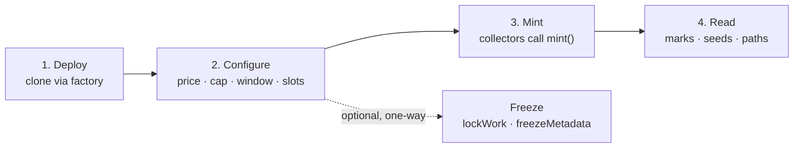
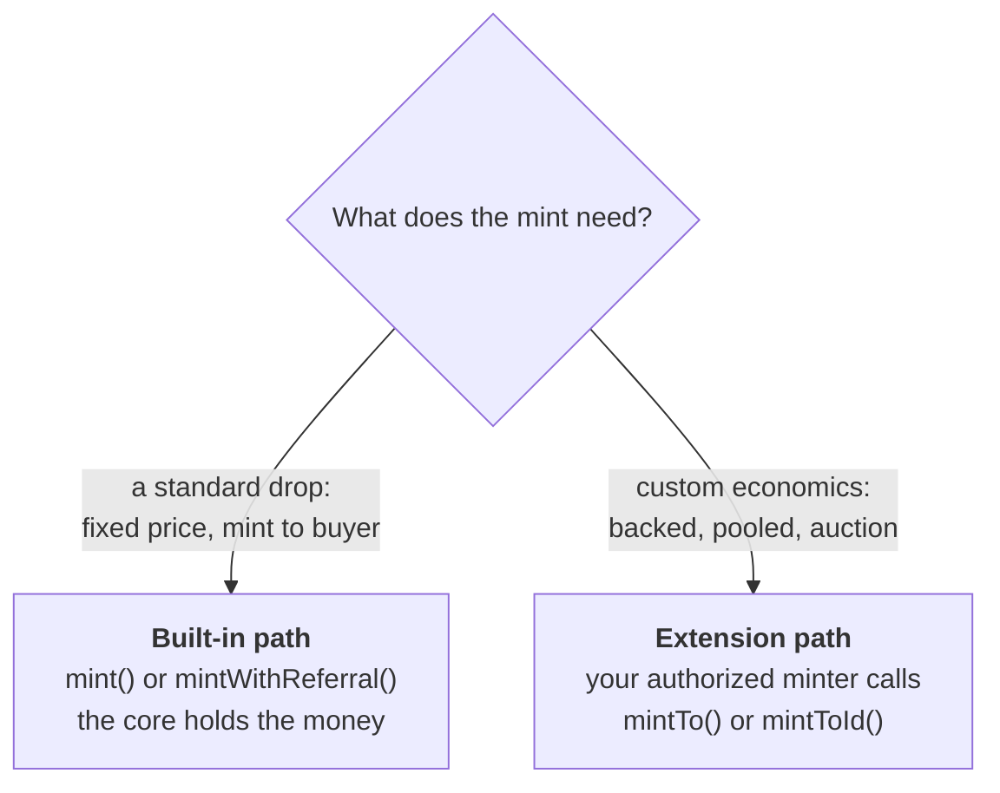
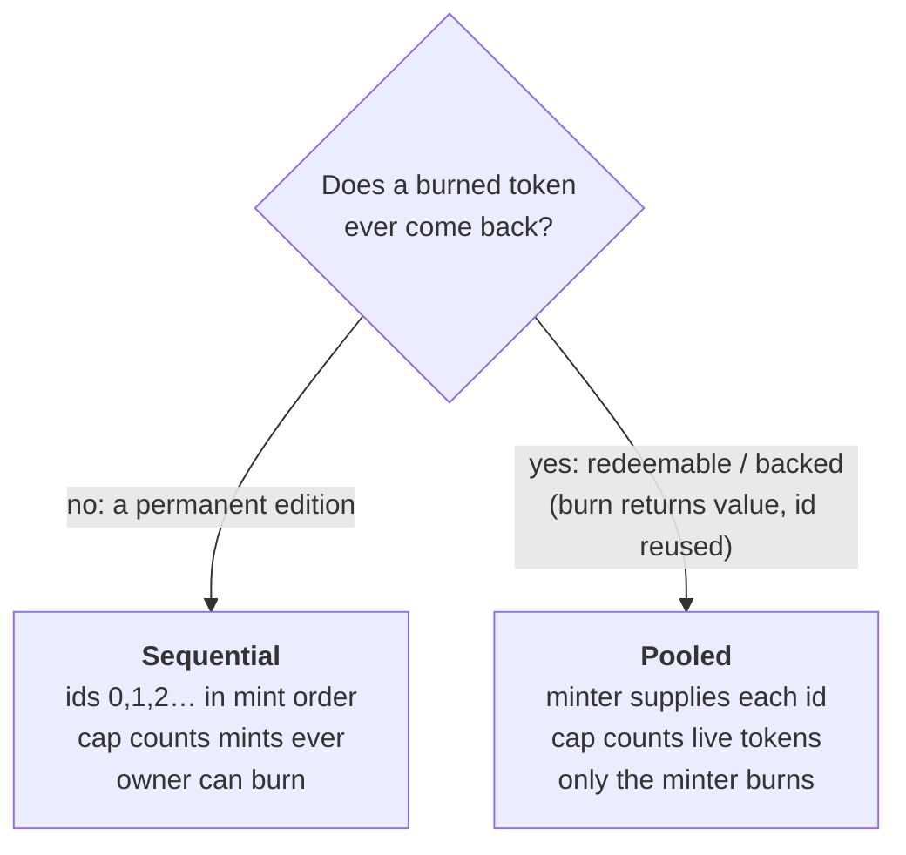

# Collection System: getting started

A practical walkthrough: deploy a collection, configure it, let people mint, and
read what comes out. Plain terms throughout. Every bolded concept is defined in
the [glossary](collection-glossary.md); the deeper rationale is in
[pnd-collection-system.md](pnd-collection-system.md).

## The one-sentence model

One **Collection** is one artist's NFT contract. You deploy it, set a few things
(price, supply, who can mint), and from then on it runs exactly as deployed,
forever.

## The lifecycle

## 1. Deploy

You do not write a contract. The **CollectionFactory** stamps out a new
**Collection** as a cheap clone and calls `initialize` on it once.

You hand `initialize` an `InitParams` bundle:

- **name, symbol, owner** for the ERC-721.
- **config**: price, supply cap, mint window, royalty, and the **id mode**
  (sequential or pooled). Most of these are fixed for good once set (see below).
- **work**: the generative work definition, if any. Empty for a plain edition.
- **slots**: the renderer, and optionally a price strategy, mint hook, and one or
  more initial extension minters. Leaving a slot empty uses the built-in default.

Because a backed or pooled work needs its minter wired in from the first block,
`initialMinters` lets you authorize those at deploy, in the same transaction.

## 2. Configure

Some settings are locked at deploy. Others you can change until you choose to
freeze. Knowing which is which matters, because the locked ones are permanent.

| Setting | When it is set | Can change later? |
| --- | --- | --- |
| price, supply cap, mint window | at deploy | no, fixed for good |
| id mode (sequential / pooled) | at deploy | no, fixed for good |
| royalty | at deploy | no, fixed for good |
| renderer, price strategy, mint hook | deploy or after | yes, until you `freezeMetadata` |
| extension minters | deploy or after | yes, grant or revoke anytime (`setMinter`) |
| work definition | deploy or after | yes, until you `lockWork` |
| payout address, per-token artwork | after | yes, until you `freezeMetadata` |

The two freeze actions are one-way:

- `lockWork` freezes the generative work definition.
- `freezeMetadata` freezes artwork and renderer changes.

Once both are done, `isPermanent()` returns true: the art can never change. The
contract itself was already immutable from deploy.

## 3. Mint

There are two mint paths. Pick by what your drop needs.

### Built-in path (most drops)

- **`mint(quantity)`**: mints to the caller at the fixed price. The whole price
  goes to the artist. This is the honest default.
- **`mintWithReferral(quantity, referrer, data)`**: the same, but 10% (the
  **referral share**) goes to whoever hosted the mint. Pass the zero address and
  it folds back to the artist. `data` is passed through to the mint hook, if any.

The core takes the money, splits it, and pays out. A mint hook (allowlist,
per-wallet cap) runs on this path too, so gating is independent of pricing.

### Extension path (custom economics)

For anything the fixed-price path cannot express (a token backed by escrowed
value, a random draw from a pool, an auction), the artist authorizes a **minter**
contract with `setMinter`, and that contract mints through:

- **`mintTo(to, referrer, data)`** in sequential mode (the core assigns the id).
- **`mintToId(to, tokenId, referrer, data)`** in pooled mode (the minter supplies
  the id).

These are non-payable: the minter handles all the money itself. Crucially, the
core still enforces the supply cap and refuses to mint a duplicate id, no matter
what the minter does. The minter is a permitted caller, never a trusted
bookkeeper.

## Sequential or pooled?

You choose this once, at deploy. It changes how ids and supply behave.

Almost every drop is **sequential**. **Pooled** is for redeemable and backed
works, where a token can be burned to reclaim value and its id returns to the
pool to be minted again.

## 4. Read

Everything a token carries is queryable onchain.

- **`config()`**: price, cap, mint window, current status, and how many have
  minted.
- **`mintMarkOf(tokenId)`**: that token's provenance (mint order, block, phase,
  referrer).
- **`tokenSeed(tokenId)`**: the token's generative seed.
- **`pathOf(tokenId)`**: the token's forward pointer, if set (see
  [Token Path](collection-glossary.md#provenance)).
- **`currentPrice(minter, quantity, data)`**: a live price quote (the strategy if
  one is set, otherwise the fixed price times quantity).
- **`referralShareBps()`**: the fixed referral share, in basis points (1000).
- **`isPermanent()`**: whether the art is frozen for good.

## Money out (pull payments)

Mint proceeds accrue to per-address balances rather than being pushed on each
mint. Anyone can trigger a payout with **`withdraw(account)`**, and the funds only
ever go to the address they are owed to. Check a balance with
`pendingWithdrawal(account)`.

## Where to go next

- Terms you hit here: [glossary](collection-glossary.md).
- Why it is built this way: [pnd-collection-system.md](pnd-collection-system.md).
- Generative work render contract: [injection-convention.md](injection-convention.md).
