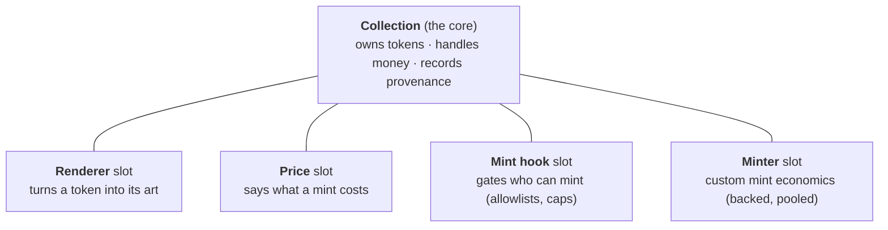

# Collection System glossary

Plain-language definitions for the PND Collection System. One or two sentences
each. The full design rationale lives in
[pnd-collection-system.md](pnd-collection-system.md); a hands-on walkthrough is
in [collection-getting-started.md](collection-getting-started.md).

## The shape of it, in one picture

A **Collection** is one artist's NFT contract. It does three jobs and nothing
else: it owns the tokens, it handles the money, and it records provenance.
Everything that varies from one artist's work to another lives in four swappable
**slots**.

## The core

**Collection** — one artist's ERC-721 contract, deployed as a cheap clone. It is
immutable from the moment it ships: no upgrades, no admin backdoor. What deploys
is what runs, forever.

**CollectionFactory** — the contract that stamps out new Collections as clones,
so deploying one costs very little gas.

**Slot** — a plug-in point on a Collection. There are four (renderer, price, mint
hook, minter). Swapping a slot changes behavior without touching the core.

**Companion contract** — an optional, small, per-work contract that holders write
to (locks, votes, attestations) and that renderers or price strategies read from.
A pattern, not part of the protocol.

## Minting

**Built-in mint** — the simple, native way to mint. A collector calls `mint()`
and pays the fixed price, and the contract holds the money. This covers most
drops.

**Extension mint** — minting through a custom **minter** contract that the artist
authorized, for economics the built-in path cannot do (a backed token, a pooled
draw, an auction). The minter handles the money; the core just issues the token.

**mint(quantity)** — the honest default. Mints `quantity` tokens to the caller at
the fixed price, with no referral cut.

**mintWithReferral(quantity, referrer, data)** — the same as `mint`, but credits
a **referrer** (whoever hosted the mint) their share. Pass the zero address and
the whole price goes to the artist.

**mintTo(to, referrer, data)** — an extension mint in sequential mode. An
authorized minter mints one token to `to`, and the core assigns the next id.

**mintToId(to, tokenId, referrer, data)** — an extension mint in pooled mode. An
authorized minter mints a token with a specific id it supplies (for example,
token #1234 for CryptoPunk #1234).

**Referral share** — a fixed 10% of a mint's price that goes to whoever hosted
the mint. On a direct or self-hosted mint it folds back to the artist. There is
no other protocol fee.

**Extension minter** — a contract the artist authorizes (`setMinter`) to mint on
custom terms. All the exotic economics live here, never in the core. The artist's
safety lever is that they can revoke the grant at any time, and the core still
enforces the supply cap and id-integrity no matter what a minter does.

**BackedMinter** — a reusable minter that escrows real value (ETH or an ERC-20)
behind each token. Redeeming burns the token and returns the value minus a fee.
(Planned fast-follow, not yet shipped.)

**PooledIdMinter** — a reusable minter that draws token ids at random from a fixed
pool and returns redeemed ids to the pool for a future draw. (Planned
fast-follow.)

## Ids and supply

**Id mode** — set once at deploy. It decides how token ids are assigned and how
supply works. There are two choices: sequential or pooled.

**Sequential** — the contract numbers tokens 0, 1, 2, and so on, in mint order.
The supply cap counts every mint ever, and burning a token does not free a slot.
This is a normal edition.

**Pooled** — an authorized minter picks each token's id, and a burned id can be
minted again as a fresh token. The cap counts tokens currently alive. This is for
redeemable or backed works, where burning returns value and the id goes back into
the pool.

**Supply cap** — the maximum supply. In sequential mode it caps total mints ever;
in pooled mode it caps how many tokens are alive at once. Zero means unlimited.
The core enforces the cap on every mint path.

## Provenance

**Mint Mark** — a small onchain record stamped on every token at mint: its mint
order, the block, the phase it minted in, and the referrer. Read it with
`mintMarkOf(tokenId)`.

**Entropy / tokenSeed** — a random 32-byte value locked into each token at mint,
read with `tokenSeed(tokenId)`. Generative art derives its look from this seed.
It can only ever be produced at mint time, which is why it lives in the core.

**Token Path** — a typed onchain "forward pointer" on a token that records where
it goes next (burned, continued, migrated, merged). It is real onchain state that
other contracts can read, not just display metadata. Set with `setPath`, read
with `pathOf`.

**Collection Graph** — typed onchain links from one collection to another (this
collection is a study of, phase of, or continuation of that one). A link can be
acknowledged by the other side, which makes the relationship verifiable as mutual.

## Art and rendering

**Renderer** — the contract that turns a token into its art. It is an onchain view
with full read access, so a token's art can depend on live chain state. If PND
disappears, the render still works.

**GenerativeRenderer** — the default renderer. It assembles a complete HTML page
from code stored onchain plus the token's seed (Art Blocks style, but rendered
entirely from chain data).

**SVGRenderer** — a base for pure-Solidity SVG art. This is the highest
permanence tier: no JavaScript, renders anywhere that can read an SVG.

**Work config** — the definition of the algorithm a generative work runs (its
code, its dependencies, its render settings), stored on the collection. The artist
can edit it until they `lockWork`, after which it is frozen forever.

**Liveness tier** — an honest label for what a faithful render needs. **pure**:
seed only, deterministic forever. **chain-live**: reads onchain state at render
time. **external-live**: reads offchain sources, and is honest that this is
fragile.

**Injection convention** — the rule that the onchain renderer, the studio preview,
the mint page, and the artist-site embed all feed a generative work the identical
token context, so a preview is byte-for-byte the real render. Spec:
[injection-convention.md](injection-convention.md).

## Permanence

**lockWork** — permanently freeze the work definition. One-way, irreversible.

**freezeMetadata** — permanently freeze artwork and renderer changes. One-way,
irreversible.

**isPermanent** — true once both the work is locked and metadata is frozen, which
means the art can never change. (The contract itself is immutable from deploy
regardless.)

## Shared infrastructure ("rails")

These are already deployed and shared by every Collection.

**Catalog** — the registry where an artist claims their works.

**Attribution** — the registry mapping works to their artist roster. A confirmed
attribution is a roster entry that the artist also claims in their own Catalog.

**MURI** — the media-permanence protocol PND uses to anchor a work's media.

**scripty v2 / EthFS** — the shared contracts that store code onchain and assemble
it into HTML.

## Shorthand and named examples

**bps** — basis points. 1 bps is 0.01%, so the 10% referral share is 1000 bps.

**EIP-1167 clone** — a tiny standard contract that forwards every call to one
shared implementation. It is why deploying a Collection is cheap: you deploy a
roughly 45-byte pointer, not a full copy of the contract.

**Homage (Homage to the Punk)** — PND's flagship live-derivative work. Each token
mirrors a specific CryptoPunk (token id equals punk id), is backed by $111 of
value, and is redeemable. The reference user of pooled plus backed minting.

**TBAM** — an earlier PND artist work with holder-actuated locks. The reference
user of companion contracts.
