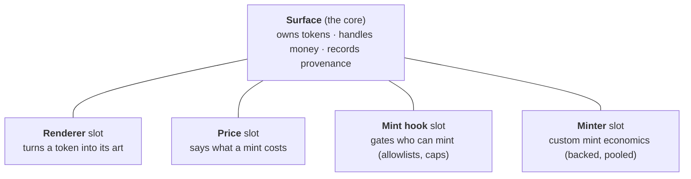

# Surface System glossary

Plain-language definitions for the PND Surface System. One or two sentences
each. The full design rationale lives in
[pnd-surface-system.md](pnd-surface-system.md); a hands-on walkthrough is
in [surface-getting-started.md](surface-getting-started.md).

## The shape of it, in one picture

A **Surface** is one artist's NFT contract. It does three jobs and nothing
else: it owns the tokens, it handles the money, and it records provenance.
Everything that varies from one artist's work to another lives in four swappable
**slots**.

## The core

**Surface** — one artist's ERC-721 contract, deployed as a cheap clone. It is
immutable from the moment it ships: no upgrades, no admin backdoor. What deploys
is what runs, forever. It comes in two forms, one per id mode: `Surface`
(sequential) and `PooledSurface` (pooled).

**SurfaceFactory** — the contract that stamps out new Surfaces as clones,
so deploying one costs very little gas. One door per form:
`createSurface` and `createPooledSurface`.

**Slot** — a plug-in point on a Surface. There are four (renderer, price, mint
hook, minter). Swapping a slot changes behavior without touching the core.

**Admin** — a key the owner grants (`addAdmin`) that can use every management
function except managing admins and transferring ownership. Flat and
full-access by design; the owner stays the root. `isAdmin` reports the owner
too, since the owner has always held every admin power.

**Companion contract** — an optional, small, per-work contract that holders write
to (locks, votes, attestations) and that renderers or price strategies read from.
A pattern, not part of the protocol.

## Minting

**Built-in mint** — the simple, native way to mint. A collector calls `mint()`
and pays the fixed price, and the contract holds the money. This covers most
drops.

**Extension mint** — minting through a custom **minter** contract that the artist
authorized, for economics the built-in path cannot do (a backed token, a pooled
draw, an auction). The minter handles the money; the core just issues the token.

**mint(quantity)** — the honest default. Mints `quantity` tokens to the caller at
the fixed price, with no referral cut.

**mintWithReferral(quantity, referrer, data)** — the same as `mint`, but credits
a **referrer** (whoever hosted the mint) their share. Pass the zero address and
the whole price goes to the artist.

**mintFor(to, quantity, referrer, data)** — the paid gift-mint: the caller pays,
`to` receives. A gift, a hot wallet buying for a vault, a sponsor covering a
collector. Allowlists and per-wallet caps judge the recipient; an overpayment
refund goes back to the payer.

**mintTo(to, referrer, data)** — an extension mint in sequential mode. An
authorized minter mints one token to `to`, and the core assigns the next id.

**mintToId(to, tokenId, referrer, data)** — an extension mint in pooled mode. An
authorized minter mints a token with a specific id it supplies (for example,
token #1234 for CryptoPunk #1234).

**Referral share** — a fixed 10% of a mint's price that goes to whoever hosted
the mint. On a direct or self-hosted mint it folds back to the artist. There is
no other protocol fee. The referrer is caller-supplied, so an ABI-savvy
collector can name themselves and keep the share — a property every open
referral system shares, accepted here rather than gatekept away.

**Extension minter** — a contract the artist authorizes (`setMinter`) to mint on
custom terms. All the exotic economics live here, never in the core. The artist's
safety lever is that they can revoke the grant at any time, and the core still
enforces the supply cap and id-integrity no matter what a minter does.

**BackedMinter** — a reusable minter that escrows real value (ETH or an ERC-20)
behind each token. Redeeming burns the token and returns the value minus a fee.
(Planned fast-follow, not yet shipped.)

**PooledIdMinter** — a reusable minter that draws token ids at random from a fixed
pool and returns redeemed ids to the pool for a future draw. (Planned
fast-follow.)

## Ids and supply

**Id mode** — a fact of which contract you deployed, not a setting. It decides
how token ids are assigned and how supply works. There are two choices:
sequential or pooled.

**Sequential** — the contract numbers tokens 1, 2, 3, and so on, in mint order:
the token id IS the mint order. The supply cap counts every mint ever, and
burning a token does not free a slot. This is a normal edition.

**Pooled** — an authorized minter picks each token's id, and a burned id can be
minted again as a fresh token. The cap counts tokens currently alive. This is for
redeemable or backed works, where burning returns value and the id goes back into
the pool. One consequence worth saying plainly: in a pooled collection the
minter contract can burn any token, at any time, without the holder's approval —
that power is what lets a redeem return value without stranding backing, and it
means the minter contract is part of what a collector is trusting. Read the
minter before you buy a pooled work; the collection lists it onchain.

**Supply cap** — the maximum supply. In sequential mode it caps total mints ever;
in pooled mode it caps how many tokens are alive at once. Zero means unlimited.
The core enforces the cap on every mint path, and `lockSupply` makes it a
promise (see Permanence).

## Provenance

**Entropy / tokenSeed** — a random 32-byte value locked into each token at mint,
read with `tokenSeed(tokenId)`. Generative art derives its look from this seed.
It can only ever be produced at mint time, which is why it lives in the core —
and it is the ONLY thing the core stores per token.

**Derived provenance** — everything else about a mint is either the token id
itself or lives in the event log. In sequential mode the id IS the mint order
(first mint = id 1; final mint = the highest id once the collection closes),
and renderers derive those traits live. The `Minted` event permanently records
the recipient, referrer, mint index, and lifecycle status; the mint block is
the log's own block. Nothing to store, nothing to drift.

## Art and rendering

**Renderer** — the contract that turns a token into its art. It is an onchain view
with full read access, so a token's art can depend on live chain state. If PND
disappears, the render still works. The artist can swap it until they
`lockRenderer`.

**DefaultRenderer** — the renderer every collection starts with: a shared,
ownerless singleton that serves the collection's static image from RenderAssets
plus derived provenance traits, as metadata JSON.

**ScriptyRenderer** — the bring-your-own generative template (Art Blocks style,
rendered entirely from chain data). Deploy one per work: the code refs are
fixed in the constructor and never mutated, so the renderer is immutable by
construction. Wire it to RenderAssets and marketplace grids get real
thumbnails; the `animation_url` is always the living work.

**Solidity SVG work** — the highest permanence tier: the image itself is
generated onchain as SVG, no JavaScript, renders anywhere that can read an SVG,
no captures needed. Such a work implements `IRenderer` directly (it is two view
functions), with the shared `MetadataJson` library handling the JSON envelope
and derived provenance traits.

**RenderAssets** — the shared registry of static display assets: each
collection's cover image, per-token captures, and a capture template that
resolves `{id}` per token. Writes use the collection's own owner/admin keys,
and captures can be delegated to a narrow **capturer** key that can touch
nothing else. Captures are refreshable forever, deliberately: they mirror the
art, they are not the art. Design: [pnd-surface-thumbnails.md](pnd-surface-thumbnails.md).

**Liveness tier** — an honest label for what a faithful render needs. **pure**:
seed only, deterministic forever. **chain-live**: reads onchain state at render
time. **external-live**: reads offchain sources, and is honest that this is
fragile. Derivable from where a work's assets live; not stored onchain.

**Injection convention** — the rule that the onchain renderer, the studio preview,
the mint page, and the artist-site embed all feed a generative work the identical
token context, so a preview is byte-for-byte the real render. Spec:
[injection-convention.md](injection-convention.md).

## Permanence

**lockRenderer** — one-way, optional: pin the renderer pointer forever, so this
exact contract answers `tokenURI` for good. An immutable renderer behind a
locked pointer is full presentation permanence; a mutable one behind a locked
pointer is the artist's explicit, inspectable choice.

**lockSupply** — one-way: lock the supply cap forever. The scarcity promise —
an edition of 100 is 100, and no later minter grant can climb over it.

Both locks can also be passed `true` at creation, so a collection can be born
locked with no second transaction to remember. (The contract itself is
immutable from deploy regardless; the locks are promises about settings, not
code.)

## Shared infrastructure ("rails")

These are already deployed and shared by every Surface.

**Catalog** — the registry where an artist claims their works.

**Creator handshake** — attribution without a registry: the collection owner
lists creators (`setCreators`), each creator claims the collection in their own
Catalog, and `isConfirmedCreator` is the live intersection. Neither side can
fake the other, and either side can retract.

**MURI** — the media-permanence protocol PND uses to anchor a work's media.

**scripty v2 / EthFS** — the shared contracts that store code onchain and assemble
it into HTML.

## Shorthand and named examples

**bps** — basis points. 1 bps is 0.01%, so the 10% referral share is 1000 bps.

**EIP-1167 clone** — a tiny standard contract that forwards every call to one
shared implementation. It is why deploying a Surface is cheap: you deploy a
roughly 45-byte pointer, not a full copy of the contract.

**Homage (Homage to the Punk)** — PND's flagship live-derivative work. Each token
mirrors a specific CryptoPunk (token id equals punk id), is backed by $111 of
value, and is redeemable. The reference user of pooled plus backed minting.

**TBAM** — an earlier PND artist work with holder-actuated locks. The reference
user of companion contracts.
